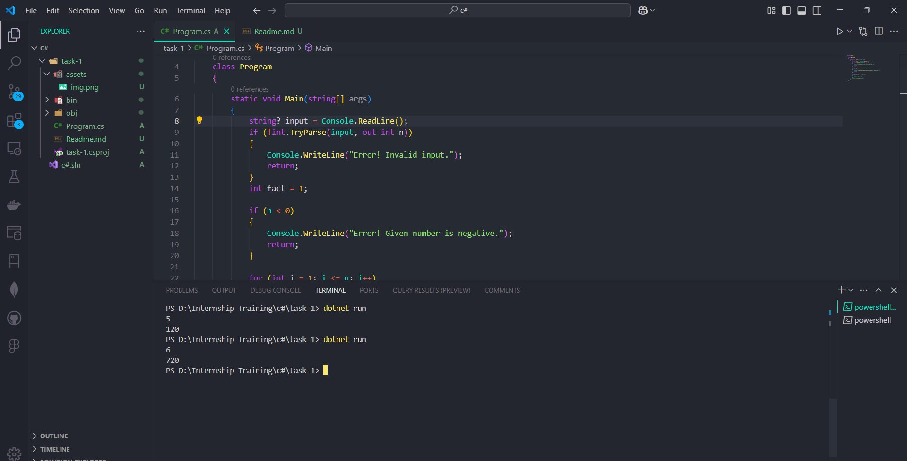

# Task Name -Write a Program to Calculate a factorial of a number using Loop or Recursion.
        
- Write a factorial program using a loop or recursion that will get a input from a user through the console and calculate the factorial of a number and print it on console.


## Concepts Learned

1. Basics of C# Syntax Structure.

- `Namespace`: Groups related classes and avoids naming conflicts.
- `Class`: A blueprint for creating objects.
- `Main` Method: Entry point of the program.
- `Statements` and `Expressions`: Basic building blocks of a program.

- Console Input and Console Output.
- Operators, Conditional Statements and Looping Statements.

2. Variables and Data Types

- Variables: Used to store data.
- Value Types: `int`, `float`, `double`, `bool`, `char`, `decimal`, etc.
- Reference Types: `string`, `object`, `array`, `class`, etc.
- Nullable Types: Allows value types to hold `null`.

3. Operators

- Arithmetic Operators: `+`, `-`, `*`, `/`, `%`
- Relational Operators: `==`, `!=`, `<`, `>`, `<=`, `>=`
- Logical Operators: `&&`, `||`, `!`
- Assignment Operators: `=`, `+=`, `-=`, `*=`, `/=`,` %=`
- Bitwise Operators: `&`, `|`, `^`, `~`, `<<`, `>>`
- Ternary Operator: `condition ? expr1 : expr2`

4. Control Flow Statements

- Conditional Statements: `if`, `else if`, `else`, `switch`.
- Looping Statements: `for`, `while`, `do-while`, `foreach`.
- Jump Statements: `break`, `continue`, `return`, `goto`.


## Code Explanation

```
namespace task_1
{
    {
        .....
    }
}

```

- Namespaces are used to organize code and avoid naming conflicts.
- They make code more readable and maintainable.
- You can use the using keyword to import namespaces for easy access.


```
namesapce task_1
{
    class Program
    {
        ....
    }
}

```

- Here the `Class Program ` defines the className of the program.


```

namespace task_1
{
    class Program
    {
        static void Main(string[] args)
        {
            // actual program or logic goes here.
        }
    }
}

```
- In the above code snippet. `static void Main(string[] args)` acts as a main method, which is the starting point of the program. When ever we run the program it starts executing from `Main()` method.
- If the same class contains a two `main` methods the method name which contains the `Main()` M caps Letter will act as a starting point of the program.


```

namespace task_1
{
    class Program
    {
        static void Main(string[] args)
        {
            string? input = Console.ReadLine();
            if (!int.TryParse(input, out int n))
            {
                Console.WriteLine("Error! Invalid input.");
                return;
            }
            int fact = 1;

            if (n < 0)
            {
                Console.WriteLine("Error! Given number is negative.");
                return;
            }

            for (int i = 1; i <= n; i++)
            {
                fact = fact * i;
            }
            Console.WriteLine(fact);
        }
    }
}
```

- The above code will calculates the factorial of a number by getting a input from users.
- `Console.ReadLine()` act as a input reader. It reads the input from user as string and we need to convert it to our needed numerical data type.
- Here first the input is readed as a string then it is converted to integer by using `int.TryParse(input,out in int)`. It checks whether the entered input is vaild or not. 
- After check the user input is valid and non-negative integer then the factorial of a number is calculated by using for loop.
- `Console.WriteLine(fact)` it will prints the calculater factorial of a number entered by the user.


## Output Of a Program

