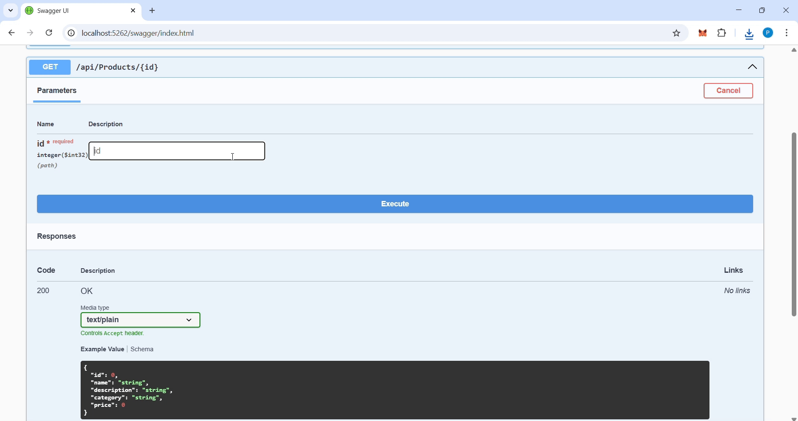
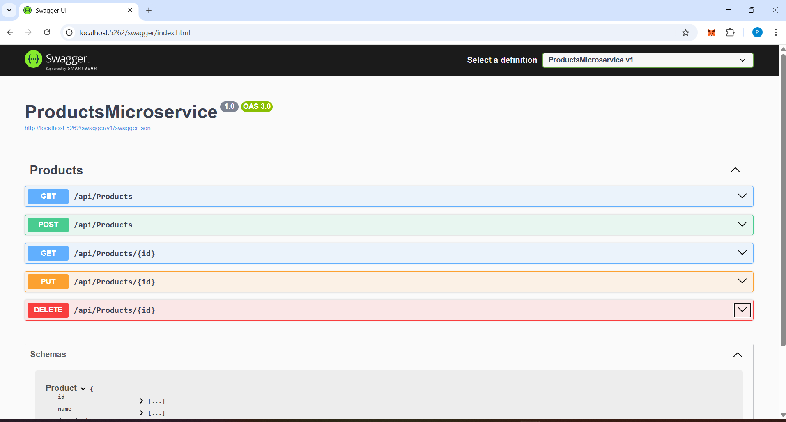
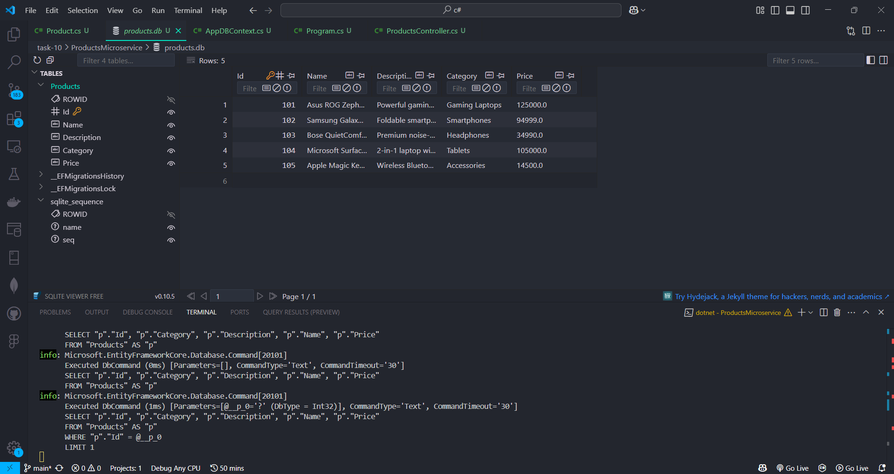

# Task - Building a Mini Microservice with ASP.NET

- Create a Small Restfull API that manages the Products database table using ASP.NET Core and Sqlite DB.

## What is Microservice?

- A microservice is an architectural approach where a large application is built as a collection of small, independently deployable services that communicate over the network.

- We are going to build a microservice that manages the products for a ecommerce store using ASP.NET and Sqlite DB.

## Initial Setup

- Create a Folder named `webapi` and run the following command to create a basic webapi template. After creating a project navigate into the project folder.

- It will create a required files and properties.

```
dotnet new webapi -n ProductsMicroservice
cd ProductsMicroservice
```

- Next install a Entity Framework Core and Sqlite Packages by running the following commands. This following commands adds the required packages for WebAPI development.

```
dotnet add package Microsoft.EntityFrameworkCore
dotnet add package Microsoft.EntityFrameworkCore.Sqlite
dotnet add package Microsoft.EntityFrameworkCore.Tools
dotnet add package Microsoft.EntityFrameworkCore.Design
```

## Create a Product Models

- Creating a product models with feilds such as product `Id`,`Name`,`Description`,`Price` as `Products` table.

```
namespace ProductsMicroservice.Models
{
    public class Product
    {   9976661831 - 2160
        public int Id { get; set; }
        public string? Name { get; set; }
        public string? Description { get; set; }
        public string? Category { get; set; }
        public decimal Price { get; set; }


    }
}
```

## Create DBContext

- The `AppDBContext` class in Entity Framework Core manages the database connection, maps C# models to tables, enables CRUD operations, tracks changes, and generates SQL commands to interact with the database.
- Below code snippet is the DB context file for products mircoservice.
- Declares a `DbSet<Product>` property named Products, which tells Entity Framework Core to create and manage a table called `Products` in the database.

```
using Microsoft.EntityFrameworkCore;
using ProductsMicroservice.Models;

namespace ProductsMicroservice.Data
{
    public class AppDBContext : DbContext
    {
        public AppDBContext(DbContextOptions<AppDBContext> options) : base(options)
        {

        }

        public DbSet<Product> Products { get; set; } = null!;
    }
}
```

## Register DB in Program.cs

- The `Program.cs` file sets up the ASP.NET Core Web API app which configures services like the database, swagger and routes.
- `WebApplication.CreateBuilder(args)` - It creates the builder object that used to configure our app (services, middleware, etc.).
- `UseSqlite("Data Source=products.db")` - It Configures it to use SQLite as the database, using `products.db` as the file.
- Adds support for controllers, enabling the app to handle HTTP requests.
- Adds authorization middleware and Maps all the routes defined in your controller classes ( `ProductsController`).

```
using Microsoft.EntityFrameworkCore;
using ProductsMicroservice.Data;
using ProductsMicroservice.Models;
using Microsoft.OpenApi.Models;

var builder = WebApplication.CreateBuilder(args);

builder.Services.AddDbContext<AppDBContext>(options =>
    options.UseSqlite("Data Source=products.db"));

builder.Services.AddControllers();
builder.Services.AddEndpointsApiExplorer();
builder.Services.AddSwaggerGen();

var app = builder.Build();


if (app.Environment.IsDevelopment())
{
    app.UseSwagger();
    app.UseSwaggerUI();
}

app.UseAuthorization();
app.MapControllers();
app.Run();
```

## Controllers and API Responses

- A Controller is a C# class that handles incoming HTTP requests, processes them, and returns a response
- It’s a central part of the MVC (Model-View-Controller) pattern.
- Is contains with `[ApiController]` and `[Route]` attributes.
- Contains action methods like `Get()`, `Post()`, `Put()`, `Delete()` to handle different HTTP verbs.

1. Class & Constructor
   - `[ApiController]`: Tells ASP.NET Core this is a Web API controller (automatically handles validation, etc.).
   - `[Route("api/[controller]")]`: Sets the route to /api/products (based on the class name).
   - ProductsController is the controller class.
   - It uses dependency injection to get the database context AppDBContext, which is used to interact with the Products table in the database.

```
[ApiController]
[Route("api/[controller]")]
public class ProductsController : ControllerBase
{
    private readonly AppDBContext _context;

    public ProductsController(AppDBContext context)
    {
        _context = context;
    }
}
```

2.  Get All Products

        - Route: `GET /api/products`
        - Returns all products from the database.
        - Uses ToListAsync() to fetch all records asynchronously.
        - Returns a list of Product objects.
        - Below Figure shows the response of Get metho route which returs all the products from the table.

```
[HttpGet]
public async Task<ActionResult<IEnumerable<Product>>> GetProducts()
{
    return await \_context.Products.ToListAsync();
}

```


3. Get Products based on ID

   - Route: `GET /api/products/{id}`
   - Tries to find a product with the given id.
   - If not found, returns 404 Not Found.
   - If found, returns the product as JSON.
   - Below Figure shows the response of this api route by sending the product `id`.

```
[HttpGet("{id}")]
public async Task<ActionResult<Product>> GetProduct(int id)
{
    var product = await _context.Products.FindAsync(id);

    if (product == null)
    {
        return NotFound();
    }

    return product;
}
```



4. Inserting a New Products By POST Method
   - Route: `POST /api/products/bulk`
   - Accepts a list of products in the request body (`[FromBody]`).
   - Adds them all to the database using `AddRange()`.
   - Saves changes with `SaveChangesAsync()`.
   - Returns `200 OK` with the inserted products.
   - Below figure shows the example of adding a new products and its response.

```
[HttpPost("bulk")]
public async Task<ActionResult> CreateProducts([FromBody] List<Product> products)
{
    _context.Products.AddRange(products);
    await _context.SaveChangesAsync();

    return Ok(products);
}
```


5. Updating the product by PUT Method

   - Route: `PUT /api/products/{id}`
   - Updates an existing product.
   - First checks if `id` in URL matches `product.Id` in body. If not, returns `400 Bad Request`.
   - Marks the entity as modified.
   - Saves changes.
   - Returns `204 No Content` (means successful but no body in response).
   - Below figure shows the example of updating a product in the table based on product `id`.

```
[HttpPut("{id}")]
public async Task<ActionResult> UpdateProduct(int id, Product product)
{
    if (id != product.Id)
    {
        return BadRequest();
    }

    _context.Entry(product).State = EntityState.Modified;
    await _context.SaveChangesAsync();
    return NoContent();
}
```


6. Deleting a Product Based on Product ID
   - Route: `DELETE /api/products/{id}`
   - Finds the product by `id`.
   - If not found, returns `404` Not Found.
   - If found, deletes the product and saves changes.
   - Returns `204 No Content`.
   - Below figure shows the example of deleting a product based on product `id`.

```
[HttpDelete("{id}")]
public async Task<ActionResult> DeleteProduct(int id)
{
    var product = await _context.Products.FindAsync(id);
    if (product == null)
    {
        return NotFound();
    }

    _context.Products.Remove(product);
    await _context.SaveChangesAsync();

    return NoContent();
}
```


7. Running a migration

- Execute the following command to create a products.db file on our project directory.

```
dotnet ef migrations add InitialCreate
dotnet ef database update
```

8. Running the API

- To run the api execute the below command and navigate to the port shown in the tarminal (ex. `https://localhost:5001/swagger`).
- After navigating to the port you will see the swagger ui with you microservice name like this below image.

```
dotnet build
dotnet run
```




## Database view

- Below image shows the Sqlite Database with `products` table and the data added through the endpoints.




## Summary of Routes

- The Microservice for Products manage is created and the table shows the `HTTP` methods and `routes` for the controllers.

| HTTP Method | Route                | Action                |
| ----------- | -------------------- | --------------------- |
| `GET `      | `/api/products`      | Get all products      |
| `GET `      | `/api/products/{id}` | Get product by ID     |
| `POST`      | `/api/products/bulk` | Add multiple products |
| `PUT `      | `/api/products/{id}` | Update a product      |
| `DELETE`    | `/api/products/{id}` | Delete a product      |
