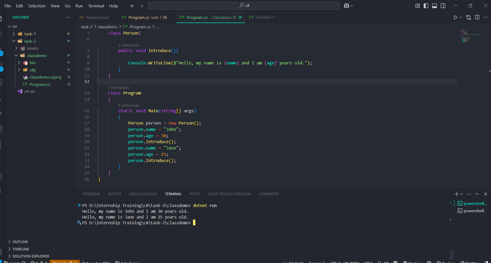

## Task Name - Working with Class and Objects

- Create a class which gets a `name` and `age` as a input and introduce the person details by creating a `Introduce()` method.

# Concepts Learned

- `Class` : Blueprints or template that defines the structure and behvaior of the objects.
- `Object` : It object is an instance of a class that holds data and can perform actions defined by its methods.
- `Accessing Fields` and `Methods`: Uses the dot `(.)` operator to access fields and methods. To set the value for properties we will use `(.)` operator.

# Code Snippet

```
class Person
{
        public string? name ;
        public int? age;

        public void Introduce(){

            Console.WriteLine($"Hello, my name is {name} and I am {age} years old.");
        }
}

```

- Class is created with a name of `Person`. 
- `name` is a nullable string (class properties) field that can store a text value or `null`.
- `age` is a nullable integer (class properties) field that can store a numeric value or `null`.
- The method Introduce prints the person's name and age using string interpolation `($)`.


```
class Program
{
    static void Main(string[] args)
    {
        Person person = new Person();
        person.name = "John";
        person.age = 30;
        person.Introduce();
        person.name = "Jane";
        person.age = 25;
        person.Introduce();
   }
}
```

- Uses the `new` keyword to create an object of the Person class.
- Accesses the `name` and `age` properties using the dot `(.)` operator.
- Calls the `Introduce()` method to print the introduction message.
- Updates the class properties values and calls the method again to print the new message.


# Console Output


