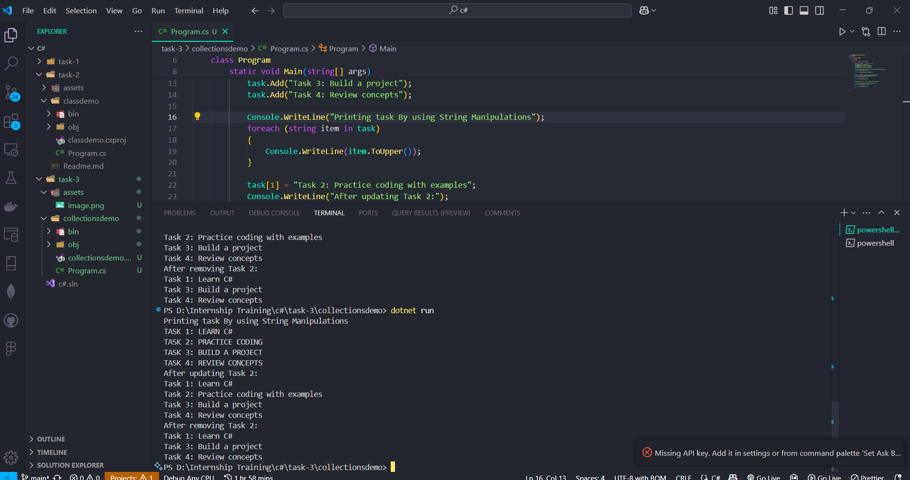
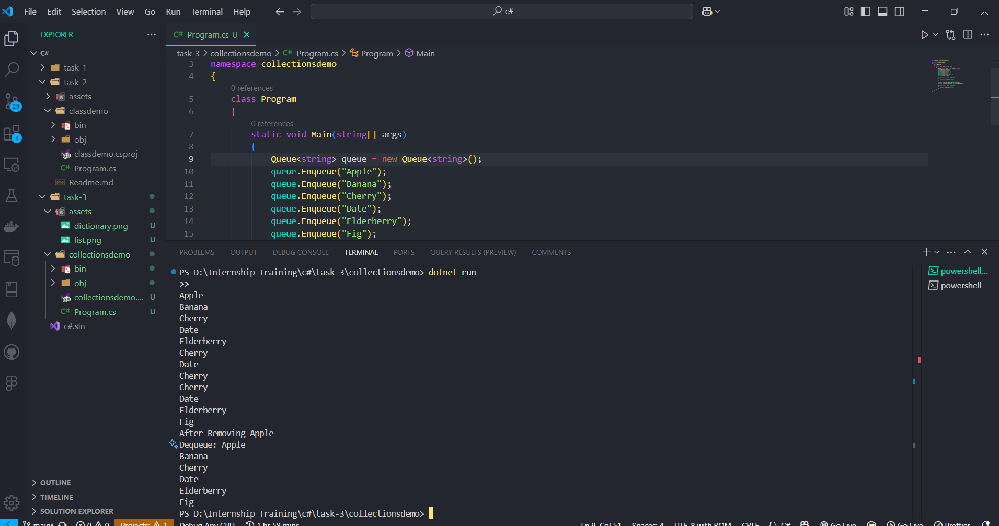
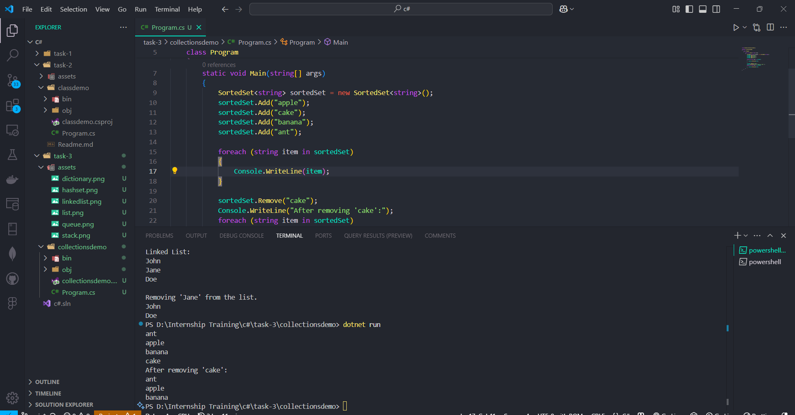
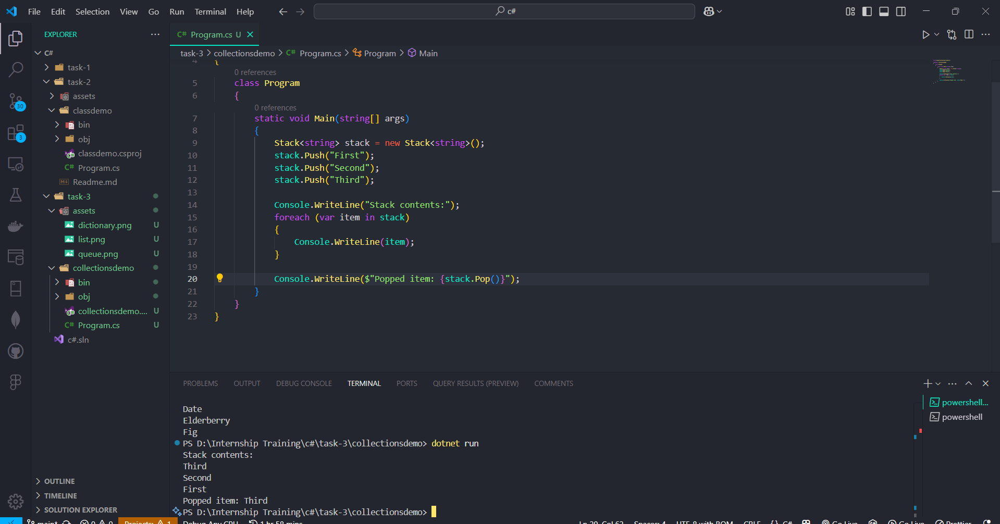
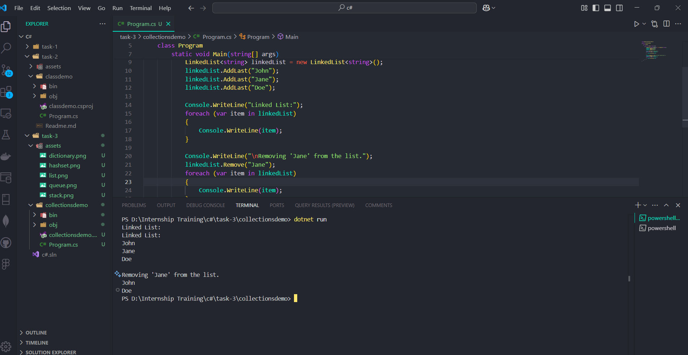
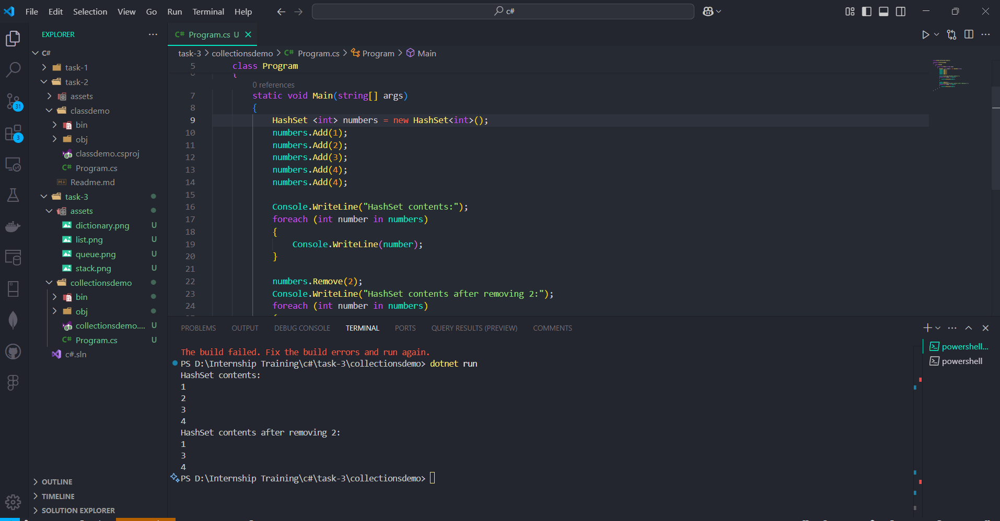
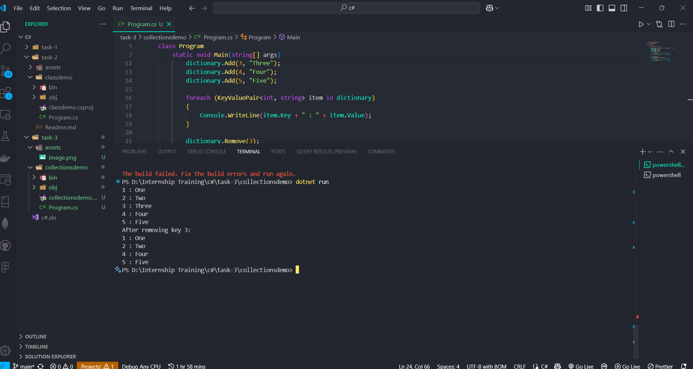

# Task Name - Working Basic Collections and String Manipulation

- Working with a Generic and Non-Generic collections.

## Collections and Its Types

- Collections are used to store, retrieve, and manipulate data. Collections provide more flexibility than arrays by allowing dynamic resizing, sorting, searching, and other functionalities.

## Types of Collections

1. Non-Generic COllections

   - These collections can store any type of data, but they are not type-safe.

2. Generic Collections
   - These collections are type-safe and can only store objects of a specified type.

## Generic Collections

1. List<T>

```
  List<String> = new List<String>();
```

- `List` is a dynamic array and part of generic collections and allows to perform Addition, Deletion, Index based updation.
- It is Type-safe, only the specified type element only added.

2. Dictionary<TKey, TValue>

```
Dictionary<string, int> ageDictionary = new Dictionary<string, int>();
```

- A Dictionary stores key-value pairs. The key is unique, and each key maps to a value.

3. Queue<T>

```
Queue<string> queue = new Queue<string>();
```

- A Queue is a first-in, first-out (FIFO) collection. Items are added at the end and removed from the front.

4. Stack<T>

```
  Stack<string> stack = new Stack<string>();
```

- A Stack is a last-in, first-out (LIFO) collection. The last item added is the first item removed.

5. HashSet<T>

```
HashSet<int> numbers = new HashSet<int>();
```

- A HashSet is a collection that contains no duplicate elements and has no specific order.

6. LinkedList<T>

```
 LinkedList<int> linkedList = new LinkedList<int>();

```

- A LinkedList is a doubly linked list. It allows for fast insertions and deletions at both ends.

## Non-Generic Collections

1. ArrayList

- A dynamic array that can hold elements of any data type (non-generic).

```
ArrayList arrList = new ArrayList();
```

2. Hashtable

- A collection of key-value pairs, implemented as a hash table.

```
Hashtable hashtable = new Hashtable();
```

3. Queue

- A FIFO collection, similar to Queue<T>, but not type-safe.

```
 Queue queue = new Queue();
```

4. Stack

- A LIFO collection, similar to Stack<T>, but not type-safe.

```
Stack stack = new Stack();
```

5. SortedList

- A collection of key-value pairs, similar to SortedList<TKey, TValue>, but non-generic.

```
SortedList sortedList = new SortedList();
```

## Common String Manipulations

1. Concatenating Strings

- Combine multiple strings into one.

```
string fullName = firstName + " " + lastName;
```

2. String Interpolation

- Embed expressions inside strings for better readability.

```
string fullName = $"{firstName} {lastName}";
```

3. Substring

- Extract a part of a string.

```
string sub = text.Substring(7, 5);
```

4. Changing Case

- Convert a string to lowercase or uppercase.

```
string lower = text.ToLower();
string upper = text.ToUpper();
```

5. Trimming Whitespace

- Remove leading and trailing whitespaces.

```
string trimmedText = text.Trim(); 
```

6. Replacing Substrings

- Replace parts of a string with another string.

```
string replacedText = text.Replace("World", "C#");
```

7. Splitting a String

- Split a string into an array based on a delimiter.

```
string[] fruits = text.Split(',');
```

8. Checking if a String Contains a Substring

- Check if a string contains another substring.

```
bool contains = text.Contains("World"); 
```

9. Finding Substring Position

- Find the index of a substring.

```
int index = text.IndexOf("World");
```

10. String Length

- Get the length of a string.

```
Console.WriteLine(text.Length);
```

11. Escaping Special Characters

- Include special characters in a string by escaping them.

```
string text = "She said, \"Hello!\"";
```

12. String to Char Array

- Convert a string to a character array.

```
char[] chars = text.ToCharArray();
```

13. Removing a Character

- Remove a character or substring from a string.

```
string removed = text.Remove(5, 7); 
```

14. Padding a String

- Add padding characters to the left or right of a string.

```
string padded = text.PadLeft(10, '*');
```


## Task Performed

- Create a `List<string>` and add a list of task inside the list and perform Add, Update and Remove operation along with string manipulations.

## Code Snippet

```
using System.Collections.Generic;
using System;

namespace collectionsdemo
{
    class Program
    {
        static void Main(string[] args)
        {
            List<string> task = new List<string>();
            task.Add("Task 1: Learn C#");
            task.Add("Task 2: Practice coding");
            task.Add("Task 3: Build a project");
            task.Add("Task 4: Review concepts");

            Console.WriteLine("Printing task By using String Manipulations");
            foreach (string item in task)
            {
                Console.WriteLine(item.ToUpper());
            }

            task[1] = "Task 2: Practice coding with examples";
            Console.WriteLine("After updating Task 2:");
            foreach (string item in task)
            {
                Console.WriteLine(item);
            }

            task.Remove("Task 2: Practice coding with examples");

            Console.WriteLine("After removing Task 2:");
            foreach (string item in task)
            {
                Console.WriteLine(item);
            }
        }
    }
}

```

- Create a `List` in the name of Task.
- Added a list of task using `task.add('task details');`
- Printed the `List` items using `foreach` loop.
- Updated the particular task using `index` based updation.
- Able to remove the task from list using `task.Remove('taskname')`.
- Performed a string manipluation by using `task.ToUpper()`. It prints the tasks in Uppercase.

## Task Output

- List example output.



- Queue example output.



- SortedList example output.



- Stack example output



- LinkedList example output



- HashSet example output



- Dictionary example output

