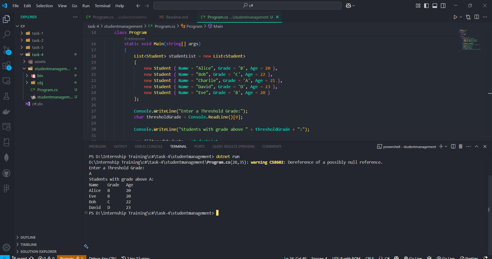

# Task Name - Working with Collections and LINQ

- Create a student management console applications using a `List<T>` collection type and load with sample data.
- Use LINQ to sort the student based on grade and filter the students based on entered threshold.

## What is LINQ?

- LINQ stands for Language Integrated Query. It is a powerful feature in C# that allows you to query and manipulate data in a more readable and concise way.

## LINQ Syntax

1. Query Syntax

```
var filtered = from student in students where student.Grade > A orderby student.Name select student.
```

2. Method Syntax

```
var filtered = students.Where(student => student.Grade > A ).OrderBy(student => student.Name);
```

## Common LINQ Methods

1. `Where()` - Filters elements based on a condition.
2. `Select()` - Projects each element into a new form.
3. `OrderBy()` /`OrderByDescending()`- Sorts the elements.
4. `GroupBy()` - Groups elements by a key.
5. `Sum()`, `Count()`, `Average()` - Aggregate functions.

## Code Snippet And Explanation

1. Student Class Definition

```
class Student
{
    public string? Name;
    public char Grade;
    public int Age;
}
```

- A student `Class` which contains the properties of `Name`, `Grade` and `Age`. 

2. Main Method and List Initialization

```
List<Student> studentList = new List<Student>
{
    new Student { Name = "Alice", Grade = 'B', Age = 20 },
    new Student { Name = "Bob", Grade = 'C', Age = 22 },
    new Student { Name = "Charlie", Grade = 'A', Age = 21 },
    new Student { Name = "David", Grade = 'D', Age = 23 },
    new Student { Name = "Eve", Grade = 'B', Age = 20 }
};

```

- A `List` is created with `student` class properties.
- Using an object initializer to add students directly to the list.

3. Input Threshold Grade

```
Console.WriteLine("Enter a Threshold Grade:");
char thresholdGrade = Console.ReadLine()[0];
```

- Prompts the user to enter a grade threshold.
- Uses `Console.ReadLine()` to read the input as a string.
- Takes the first character of the input string to get the grade.

4. Filter and Sort Using LINQ

```
var filteredStudents = studentList.Where(s => s.Grade > thresholdGrade).OrderBy(s => s.Grade);
```

- Uses LINQ to filter students whose grade is greater than the threshold.
- Uses OrderBy() to sort the filtered students in ascending order of grade.

5. Display the Filtered Students

```
Console.WriteLine("Name\tGrade\tAge");
foreach (var student in filteredStudents)
{
    Console.WriteLine($"{student.Name}\t{student.Grade}\t{student.Age}");
}
```

- Prints a table header with `Name`, `Grade`, and `Age`.
- Uses a foreach loop to iterate over the filtered and sorted list.
- Uses string interpolation to format the output.

## Program Output



