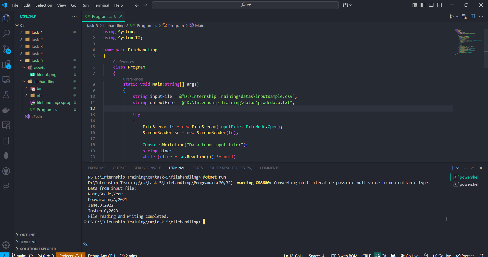
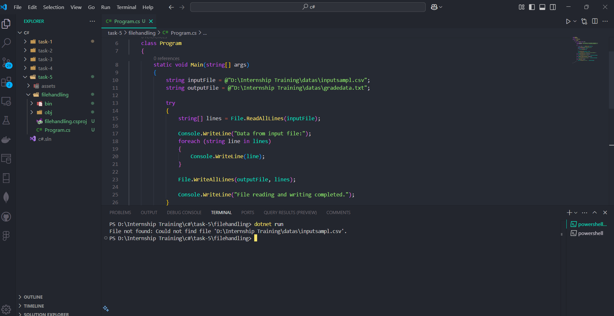

# Task - Working with File I/O and Exception Handling

- Write a program that reads the input from CSV file using `FileStream` and again write the readed data from csv file to text file.

## File I/O

- It is all about reading from and writing to files and directories. It is an essential part of many applications that need to store, process, or display data.

## Common File I/O Classes

1. `File`: Provides static methods for creating, copying, deleting, moving, and opening files.
2. `FileInfo`: Provides instance methods for the same operations as the File class.
3. `FileStream`: Used to read from and write to files as bytes.
4. `StreamReader`: Reads text from a file.
5. `StreamWriter`: Writes text to a file.
6. `BinaryReader`: Reads binary data from a file.
7. `BinaryWriter`: Writes binary data to a file.
8. `Directory`: Performs operations on directories.
9. `DirectoryInfo`: Provides instance methods for directory operations.
10. `Path` : Performs operations on path strings.


## Expections

- Exception handling that helps to maintain application stability by managing runtime errors. Proper handling prevents crashes and provides meaningful error messages to users.

## Common Keywords for Exception Handling

1. `try`: Monitors a block of code for exceptions.
2. `catch`: Handles exceptions that occur in the try block.
3. `finally`: Executes regardless of whether an exception was caught.
4. `throw`: Manually triggers an exception. 

## Basic Exception Handling Structure

```
try
{
    int result = 10 / 0;
    Console.WriteLine(result);
}
catch (DivideByZeroException ex)
{
    Console.WriteLine("Error: Division by zero is not allowed. " + ex.Message);
}
finally
{
    Console.WriteLine("Execution completed.");
}
```

## File Input task

- Below code snippet contains the variable `inputfile` and `outputfile` contains the path to read the file and path to store the readed csv file content to text file.
- Using `trycatch` to handle the `Expection` while reading or writing the file.
- In the below code snippet you see the `trycatch` block. Inside the `try` file is accessed with `FileStream` and Readed it using `StreamReader`.
- While Reading the file if we face any isses then the program will stops its execution to avoid this unexpected termination of the program we are defining a alternative way for smooth execution of program using `trycatch` expection handling method.
- In the below code while reading the file if it a error beacuse of invalid file path or name will cause a `FileNotFoundException` it will be handled by catch block. 
- If file path is valid but access is not provided means then it will cause a exception and handled it using a `catch(UnauthorizedAccessException)` block.
- Like this we are able to handle expections that occur in the program to avoid the unexpected termination of the program.

```
using System;
using System.IO;

namespace Filehandling
{
    class Program
    {
        static void Main(string[] args)
        {
            string inputFile = @"D:\Internship Training\datas\inputsample.csv";
            string outputFile = @"D:\Internship Training\datas\gradedata.txt";

            try
            {
                FileStream fs = new FileStream(inputFile, FileMode.Open);
                StreamReader sr = new StreamReader(fs);

                Console.WriteLine("Data from input file:");
                string line;
                while ((line = sr.ReadLine()) != null)
                {
                    Console.WriteLine(line);

                    FileStream fsWrite = new FileStream(outputFile, FileMode.Append, FileAccess.Write);
                    StreamWriter sw = new StreamWriter(fsWrite);
                    sw.WriteLine(line);
                    sw.Close();
                    fsWrite.Close();
                }


                sr.Close();
                fs.Close();

                Console.WriteLine("File reading and writing completed.");
            }
            catch (FileNotFoundException filenotfound)
            {
                Console.WriteLine("File not found: " + filenotfound.Message);
            }
            catch (UnauthorizedAccessException unauthaccess)
            {
                Console.WriteLine("Access denied: " + unauthaccess.Message);
            }
            catch (IOException ioex)
            {
                Console.WriteLine("I/O error: " + ioex.Message);
            }
        }
    }
}
```

## Task output

- Smooth Execution of Program and printing the file data.



- FileNotFoundException Example output.

