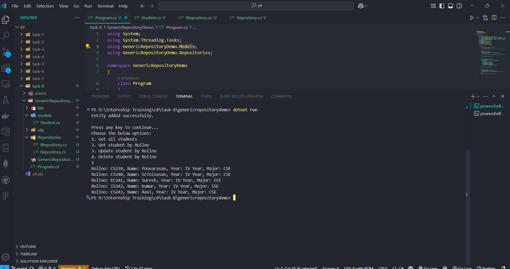
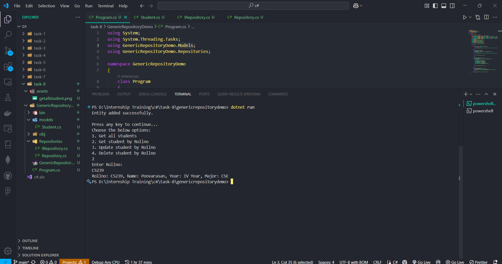
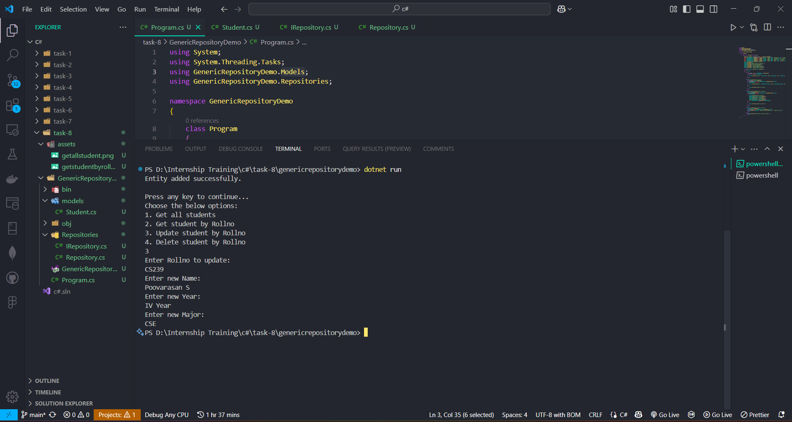
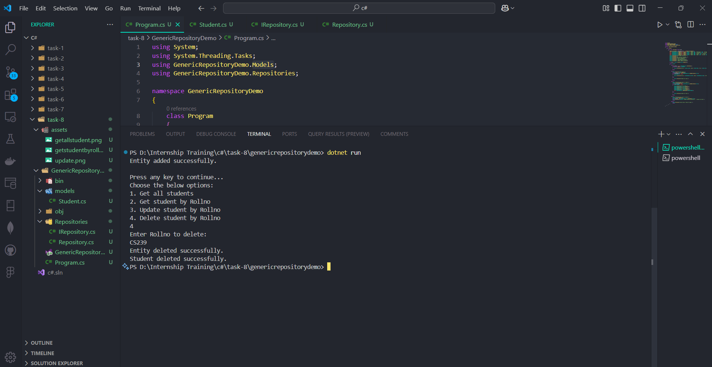

# Task - Working with Interface and Repository Patterns

- Build a Console Application with generic in-memory repository to perform CRUD Operations.

## Interface

- It is a contract that defines a set of methods, properties, events, or indexers without implementing them.
- A class or struct that implements an interface must provide the concrete implementation of all its members.
- Interfaces are used to achieve polymorphism and abstraction.

## Syntax

```
public interface IShape
{
    void Draw();
    double GetArea();
}
```

## Repository Pattern

- The Repository Pattern is a design pattern used to separate the data access logic from the business logic in an application.
- It acts as a middle layer between the data source (like a database) and the business logic, providing a way to perform CRUD (Create, Read, Update, Delete) operations in a more abstract way.

## Basic structure

- `Repository Interface`: Defines the contract for data operations.
- `Concrete Repository Class`: Implements the interface.
- `Service or Business Logic`: Uses the repository to perform operations.

## Task Code Explanation

## Create a Model (Entity)

- Created a `Student` Class with a `RollNo`, `Name`, `Year`, `Major` as properties to use in the application.

```
namespace GenericRepositoryDemo.Models
{
    public class Student
    {
        public string RollNo { get; set; } = string.Empty;
        public string Name { get; set; } = string.Empty;
        public string Year { get; set; }
        public string Major { get; set; } = string.Empty;
    }
}
```

## Create the Repository Interface

- The `IRepository` interface defines the contract for CRUD operations.

```
using System.Collections.Generic;
using System.Threading.Tasks;

namespace GenericRepositoryDemo.Repositories
{
    public interface IRepository<T> where T : class
    {
        Task AddAsync(T entity);
        Task UpdateAsync(T entity);
        Task<bool> DeleteAsync(string rollno);
        Task<T?> GetByRollnoAsync(string rollno);
        Task<IEnumerable<T>> GetAllAsync();
    }
}
```

## Implementation of Repository Interface

```
public async Task AddAsync(T entity)
{
    await Task.Run(() =>
    {
       _items.Add(entity);
    });
}

```

- `AddAsync`: Adds a new entity to the repository.

```
public async Task<T?> GetByRollnoAsync(string rollno)
{
    return await Task.Run(() =>
    {
        return _items.FirstOrDefault(item =>
        {
            var rollnoProperty = item.GetType().GetProperty("RollNo");
            return rollnoProperty != null && (string)rollnoProperty.GetValue(item) == rollno;
       });
    });
}
```

- `GetByRollnoAsync`: Retrieves an entity by its RollNo property.

```
public async Task<IEnumerable<T>> GetAllAsync()
{
    eturn await Task.Run(() => _items.ToList());
}
```

- `GetAllAsync` : Retrieves all entities from the repository.

```
public async Task UpdateAsync(T entity)
{
    await Task.Run(() =>
    {
        var rollnoProperty = entity.GetType().GetProperty("Rollno");
        if (rollnoProperty != null)
        {
            string? rollno = (string?)rollnoProperty.GetValue(entity);
            var existingItem = _items.FirstOrDefault(item =>
            {
                var itemRollnoProperty = item.GetType().GetProperty("Rollno");
                return itemRollnoProperty != null && (string)itemRollnoProperty.GetValue(item) == rollno;
            });

            if (existingItem != null)
            {
                int index = _items.IndexOf(existingItem);
                _items[index] = entity;
                Console.WriteLine("Entity updated successfully.");
            }
            else
            {
                Console.WriteLine("Entity not found.");
            }
        }
    });
}
```

- `UpdateAsync`: Updates an existing entity based on its `RollNo`.

```
public async Task<bool> DeleteAsync(string rollno)
{
    return await Task.Run(() =>
    {
        var item = _items.FirstOrDefault(x =>
        {
            var rollnoProperty = x.GetType().GetProperty("RollNo");
            return rollnoProperty != null && (string)rollnoProperty.GetValue(x) == rollno;
        });

        if (item != null)
        {
            _items.Remove(item);
            Console.WriteLine("Entity deleted successfully.");
            return true;
        }

            Console.WriteLine("Entity not found.");
            return false;
    });
}
```

- `DeleteAsync`: Deletes an entity by `RollNo`.
- The `GetPropertyValue` helper method uses reflection to dynamically access the `RollNo` property of an entity.

## Using the Repository in Main Logic

1. Using Directives

```
using GenericRepositoryDemo.Models;
using GenericRepositoryDemo.Repositories;
```

- `GenericRepositoryDemo.Models` and `GenericRepositoryDemo.Repositories` for accessing models and repositories.

2. Initializing the Repository

```
IRepository<Student> studentRepository = new Repository<Student>();
await studentRepository.AddAsync(new Student { RollNo = "CS239", Name = "Poovarasan", Year = "IV Year", Major = "CSE" });
await studentRepository.AddAsync(new Student { RollNo = "CS240", Name = "Srinivasan", Year = "IV Year", Major = "CSE" });
await studentRepository.AddAsync(new Student { RollNo = "EC241", Name = "Suresh", Year = "IV Year", Major = "ECE" });
await studentRepository.AddAsync(new Student { RollNo = "IS242", Name = "Kumar", Year = "IV Year", Major = "ISE" });
await studentRepository.AddAsync(new Student { RollNo = "CS243", Name = "Ravi", Year = "IV Year", Major = "CSE" });
Console.WriteLine("Entity added successfully.");
```

- Creates a generic student repository instance.
- Adds five student entities asynchronously.
- Displays a success message upon adding the entities.

3. Displaying Options to the User

```
Console.WriteLine("Press any key to continue...");
Console.WriteLine("Choose the below options:");
Console.WriteLine("1. Get all students");
Console.WriteLine("2. Get student by Rollno");
Console.WriteLine("3. Update student by Rollno");
Console.WriteLine("4. Delete student by Rollno");
```

- Provides the user with a menu to perform `CRUD` operations.

4. Reading User Choice

```
int choice = Convert.ToInt32(Console.ReadLine());
```

- Captures the user's choice as an integer.

5. Switch Case to Handle User Choices

- Case 1: Get All Students

```
case 1:
    var students = await studentRepository.GetAllAsync();
    foreach (var student in students)
    {
        Console.WriteLine($"Rollno: {student.RollNo}, Name: {student.Name}, Year: {student.Year}, Major: {student.Major}");
    }
    break;
```

- Retrieves all students asynchronously.
- Displays each student's details.

- Case 2: Get Student by Roll Number

```
case 2:
    Console.WriteLine("Enter Rollno:");
    string rollno = Console.ReadLine();
    var studentByRollno = await studentRepository.GetByRollnoAsync(rollno);
    if (studentByRollno != null)
    {
        Console.WriteLine($"Rollno: {studentByRollno.RollNo}, Name: {studentByRollno.Name}, Year: {studentByRollno.Year}, Major: {studentByRollno.Major}");
    }
    else
    {
        Console.WriteLine("Student not found.");
    }
    break;
```

- Prompts the user to enter a roll number.
- Searches for the student and displays the details if found, or a "not found" message otherwise.

- Case 3: Update Student by Roll Number

```
case 3:
    Console.WriteLine("Enter Rollno to update:");
    rollno = Console.ReadLine();
    var studentToUpdate = await studentRepository.GetByRollnoAsync(rollno);
    if (studentToUpdate != null)
    {
        Console.WriteLine("Enter new Name:");
        studentToUpdate.Name = Console.ReadLine();
        Console.WriteLine("Enter new Year:");
        studentToUpdate.Year = Console.ReadLine();
        Console.WriteLine("Enter new Major:");
        studentToUpdate.Major = Console.ReadLine();
        await studentRepository.UpdateAsync(studentToUpdate);
    }
    else
    {
        Console.WriteLine("Student not found.");
    }
    break;
```

- Prompts the user to enter the roll number for updating.
- Updates the student details if found, otherwise displays an error message.

- Case 4: Delete Student by Roll Number

```
case 4:
    Console.WriteLine("Enter Rollno to delete:");
    rollno = Console.ReadLine();
    bool isDeleted = await studentRepository.DeleteAsync(rollno);
    Console.WriteLine(isDeleted ? "Student deleted successfully." : "Student not found.");
    break;
```

- Prompts the user to enter the roll number to delete.
- Deletes the student if found, otherwise shows an error message.


## Program Output

1. Case 1: Get All Students



2. Case 2: Get Student by Rollno



3. Case 3: Update Student by Rollno



4. Case 4: Delete Student by Rollno

