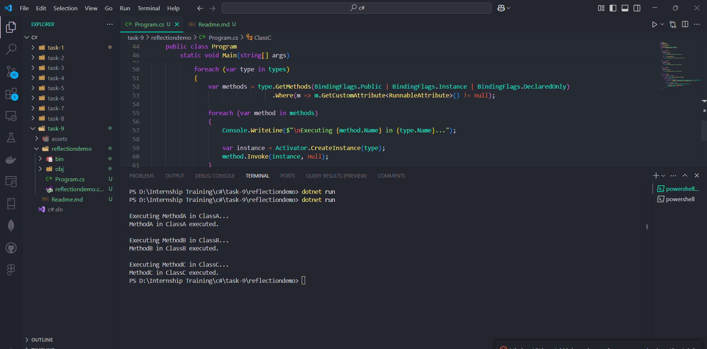

# Task - Working with Reflection and Custom Attributes

- Build an console application that discovers and executes methods based on custom attributes.

## Reflection

- It is a feature in C# that allows a program to inspect and manipulate its own metadata, types, and objects at runtime.

## Reflection Classes

| Class        | Purpose                                                        |
| ------------ | -------------------------------------------------------------- |
| Assembly     | Loads and inspects assemblies (DLLs, EXEs) at runtime.         |
| Type         | Represents type metadata (classes, structs, interfaces, etc.). |
| MethodInfo   | Provides metadata about methods.                               |
| PropertyInfo | Represents a property of a class.                              |
| FieldInfo    | Represents a field (variable) in a class.                      |
| Activator    | Creates instances of types dynamically.                        |

## Custom Attributes

- It allow us to add metadata to classes, methods, properties, etc. These attributes help in marking or categorizing elements, which can later be retrieved using reflection.

## Types Of Attributes

| Type of Attribute     | Purpose                               | Example                        |
| --------------------- | ------------------------------------- | ------------------------------ |
| Predefined Attributes | Built-in attributes in C#.            | `[Obsolete]`, `[Serializable]` |
| Custom Attributes     | User-defined attributes.              | `[Runnable]`, `[LogExecution]` |
| Reflection Attributes | Used to retrieve metadata at runtime. | `MethodInfo`, `PropertyInfo`   |

## Code Snippets with explanation

1. Defining the custom attribute

```
[AttributeUsage(AttributeTargets.Method)]
public class RunnableAttribute : Attribute
{
}
```

- `[AttributeUsage(AttributeTargets.Method)]` ensures that this attribute can only be applied to methods.
- `RunnableAttribute` is a empty class.

2. Creating a multiple classes with Runnable methods

```
public class ClassA
{
    [Runnable]
    public void MethodA()
    {
        Console.WriteLine("MethodA in ClassA executed.");
    }

    public void NonRunnableMethod()
    {
        Console.WriteLine("This method should NOT be executed.");
    }
}

public class ClassB
{
    [Runnable]
    public void MethodB()
    {
        Console.WriteLine("MethodB in ClassB executed.");
    }
}

public class ClassC
{
    [Runnable]
    public void MethodC()
    {
        Console.WriteLine("MethodC in ClassC executed.");
    }
}
```

- `ClassA`, `ClassB`, and `ClassC` contain methods decorated with `[Runnable]` classes.

3. Using Reflection to execute methods

```
var types = Assembly.GetExecutingAssembly().GetTypes();
```

- `Assembly.GetExecutingAssembly().GetTypes()` retrieves all types (classes) in the current assembly.

```
foreach (var type in types)
{
    var methods = type.GetMethods(BindingFlags.Public | BindingFlags.Instance | BindingFlags.DeclaredOnly)
                      .Where(m => m.GetCustomAttribute<RunnableAttribute>() != null);
}
```

- Find out public instance methods that have the `[Runnable]` attribute.

```
 foreach (var method in methods)
{
    Console.WriteLine($"\nExecuting {method.Name} in {type.Name}...");

    var instance = Activator.CreateInstance(type);
    method.Invoke(instance, null);
}
```

- Creates an instance of each class dynamically using `Activator.CreateInstance(type)`.
- Invokes the discovered method using `method.Invoke(instance, null);`.
- Outputs the method name and class name before execution.


## Task Code Output

